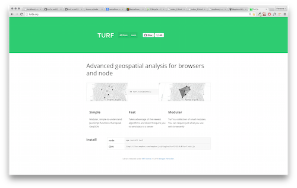

# Turf a SOD15
## Pieghiamo la geografia al nostro volere!

*Esempio preso dal post [Mapbox for Transportation](https://www.mapbox.com/blog/turf-bikeshare/)*





#Step 1 - Prepariamo la pagina

Scaricare il [**template**](https://gist.github.com/miccferr/e05ce29311841d048b06)

Per prima cosa andiamo a caricare le librerie  (file con estensione .js), insieme con il relativo foglio di stile (estensione .css).  
Per fare questo aggiungiamo i link agli scripts necessari in fondo al file, ma prima della chiusura del ```body``` (cioè prima del tag ```</body>```) :

	<!-- jquery -->
	<script src='bower_components/jquery/dist/jquery.min.js'></script>
	<!-- mapbox -->
	<script src='https://api.tiles.mapbox.com/mapbox.js/v2.1.6/mapbox.js'></script>
	<link href='https://api.tiles.mapbox.com/mapbox.js/v2.1.6/mapbox.css' rel='stylesheet' />
	<!-- bootstrap -->
	<!-- <script src='bower_components/bootstrap/dist/js/bootstrap.min.js'></script> -->
	<link href='bower_components/bootstrap/dist/css/bootstrap.min.css' rel='stylesheet' />
	<!-- leaflet -->
    <!-- <script src="http://cdn.leafletjs.com/leaflet-0.7.2/leaflet.js"></script>
    <link rel="stylesheet" href="http://cdn.leafletjs.com/leaflet-0.7.2/leaflet.css" /> -->    
    <!-- turf -->
    <script src="http://api.tiles.mapbox.com/mapbox.js/plugins/turf/v2.0.0/turf.min.js" /></script>
    <!-- ominvore -->
    <script src='script/leaflet-omnivore.min.js'></script>
    <!-- topojson -->
    <!-- <script src="topojson.js"></script> -->
    

Poi aggiungiamo il codice per definire lo stile della pagina e della mappa (dimensioni, posizione ecc..). Per fare questo usiamo un tag particolare ```<style></style>```dentro cui mettere il codice. Questo tag ed il suo contenuto vanno messi all'interno dell'```<header></header>```
	
		body { margin:0; padding:0; }
		#map { position:absolute; top:0; bottom:0; width:100%; }
	

 Solitamente è buona pratica separare il codice relativo al contenuto (HTML) dallo stile (CSS), mettendo il secondo in un file a sè stante, ma per comodità questa volta terremo tutto insieme all'interno del tag ```<header></header>```.
	
Se vi siete persi, nessuna paura!  

Qui di seguito (ed in fondo ad ogni successivo paragrafo), potete trovare un file con il codice relativo scritto fino a questo punto.  

[ **File step1** ](https://gist.github.com/miccferr/0e8f17219d94cb5b1394#file-index_1)

#Step 2 - La nostra prima web-map
Per prima cosa andiamo a definire il `div`, ovvero l'elemento HTML usato per delimitare parte di una pagina web ([più info qui](http://en.wikipedia.org/wiki/Span_and_div)),  che conterrà la nostra mappa.  
Posizioniamolo all'interno del ```<body></body>```.  
Cosi:

	<div id='map'></div>
	
Ora, con due righe di javascript chiediamo a Mapbox.js di creare una mappa dentro a questo div. Per fare questo useremo un tag simile a quello usato in precedenza per definire lo stile, ma pensato per contenre del codice javascript invece che del CSS. Inserite questa parte in fondo al file, dopo lo il link a Leaflet, e sempre prima della chiusura del tag ```body```.

    <script >

		// Provide your access token: grazie Zedda!
	L.mapbox.accessToken = 'pk.eyJ1IjoiYW5kcmlhIiwiYSI6InVkRWQtdWMifQ.PptXHNGHheaDE-EM-Lob9g';

	var map = L.map('map').setView([44.4948,11.3441],  16);
	// Attribution Link
	mapLink =
	'<a href="http://openstreetmap.org">OpenStreetMap</a>';
	L.tileLayer(
		'http://{s}.tile.openstreetmap.org/{z}/{x}/{y}.png', {
			attribution: '&copy; ' + mapLink + ' Contributors',
			maxZoom: 18,
		}).addTo(map);
	// definiamo dei layer vuoti
	var bufferLayer = L.mapbox.featureLayer();
	var nearest_fc = L.mapbox.featureLayer();
	var fc


	</script>


Non è molto, ma è pur sempre un inzio..congratulatevi con voi stessi per aver creato la vostra prima mappetta web.

[**File step2**](https://gist.github.com/miccferr/4a401ee211eee8214ad8)	

#Step 3 - Creare un marker

E' ora di mettere qualche puntina su questa cartina. 
Per aggiungere un marker, usiamo offre un metodo molto intuitivo tramite il costruttore ```L.marker([lat, lng])```.  
Questi necessita obbligatoriamente di un array di coordinate ```[Latitudine, Longitudine]```, oltre a disporre di alcuni metodi opzionali, come ```.bindPopup()``` per visualizzare un baloon sopra il marker.
Aggiungiamo quindi il seguente codice, di seguito a quello scritto in precedenza:

	// creo un marker
	var marker = L.marker(new L.LatLng( 44.49528086931113,11.347181797027588), {
		icon: L.mapbox.marker.icon({
			'marker-color': 'ff8888',
			'marker-symbol':'pitch'

		}),
		draggable:'true'
	});

Non visualizziamo direttamente il marker  però, perchè lo faremo in seguito tramite un apposito bottone.


[**File step3**](https://gist.github.com/miccferr/1d994aabf54cc457500e)	

#Step 4 - Caricare i dati


Esistono vari modi per caricare un dato su mappa,noi useremo una libreria in grado di utilizzare molte tipologie: [Ominovore](https://github.com/mapbox/leaflet-omnivore)

    // carico i dati
	var rastrelliere = omnivore.kml('data/rastrelliere.kml').addTo(map);


[**File step4**](https://gist.github.com/miccferr/c291d8b2f286f129b38d)	

#Step 5 - Creo un bottone
Aggiungo il markup html: 

	<a id='attiva-filtro' type="button" class="btn btn-default">Filtro</a>
	
e ne definisco lo stile (sempre nel tag ), sempre nel tag ```<style></style>```

  	#attiva-filtro  {
  		position: absolute;
  		top: 20px;
  		right: 10px;
  		z-index: 1;
  		background-color:#ffb2c2;
  		color:#fff;
  		font-size:1.2em;
  	}
  	#attiva-filtro:hover,
  	#attiva-filtro a:active  {
  		position: absolute;
  		top: 20px;
  		right: 10px;
  		z-index: 1;
  		background-color: #ff325e;
  		color:#fff;
  		font-size:1.2em;
  	}
  	

[**File step5**](https://gist.github.com/miccferr/cbd99555bce49a76496d)

#Step 6 - Usiamo Turf.js
## 6.1 Creazione buffer (oggetto)

Definiamo una funzione per calcolare un buffer dinamico attorno al maker:

	// Buffer dinamico attorno al marker
	function pointBuffer (pt, radius, units, resolution) {
		var ring = []
		var resMultiple = 360/resolution;
		for(var i  = 0; i < resolution; i++) {
			var spoke = turf.destination(pt, radius, i*resMultiple, units);
			ring.push(spoke.geometry.coordinates);
		}
		if((ring[0][0] !== ring[ring.length-1][0]) && (ring[0][1] != ring[ring.length-1][1])) {
			ring.push([ring[0][0], ring[0][1]]);
		}
		return turf.polygon([ring])
	}
[**File step6**](https://gist.github.com/miccferr/35057f77330038cf7123)

## 6.2 Funzione per filtrare i marker

	// get position, draw buffer, find within, find nearest, add to map
	function updateVenues(fc){
		// converto in GeoJSON il livello
		fc= fc.toGeoJSON()

		// prendo la posizione
		var position=marker.getLatLng();
		// creo un oggetto turf con la posizione
		var point=turf.point([position.lng, position.lat]);
		// calcolo un buffer attorno al punto
		var  buffer = pointBuffer(point, 1, 'kilometers', 120);
		buffer.properties = {
			"fill": "#00704A",
			"fill-opacity":0.1,
			"stroke": "#00704A",
			"stroke-width": 2,
			"stroke-opacity": 0.5
		};
		// creo il livello con il buffer
		bufferLayer.setGeoJSON(buffer);

		// filtro le features (rastrelliere delle biciclette)
		var within = turf.featurecollection(fc.features.filter(function (shop){
			if (turf.distance(shop, point, 'kilometers') <= 1) return true;
		}) 
		);

		// coloro le features
		within.features.forEach(function(feature){
			feature.properties["marker-color"] = "C73E3E";
			feature.properties["title"] = '<br>'+feature.properties["name"]+'<br>Bikes: '+feature.properties["nbBikes"]+'<br>Empty Docks: '+feature.properties["nbEmptyDocks"];
			feature.properties["marker-size"] = "small";
			feature.properties["marker-symbol"] = "bicycle";
		});

		// calcolo la feature più vicina
		nearest = turf.nearest(point, within);
		// coloro la feature più vicina
		nearest.properties["marker-color"] = "3ad78d";
		nearest.properties["title"] = '<br>'+nearest.properties["name"]+'<br>Bikes: '+nearest.properties["nbBikes"]+'<br>Empty Docks: '+nearest.properties["nbEmptyDocks"];
		nearest.properties["marker-size"] = "large";
		nearest.properties["marker-symbol"] = "bicycle";

		// creo un unica collezione di feature colorate (la più vicina + le rimanenti)
		nearest_fc.setGeoJSON(turf.featurecollection([within, nearest])).addTo(map);
	};


[**File step6**](https://gist.github.com/miccferr/a60dc986cf1fdcb4eb77)	


# Step 7 - Aggiungiamo funzionalità al bottone 

	// Funzione per gestire l'evento 'clicca' sul bottone 'Filtra' 
	$('#attiva-filtro').click(function () {
		if ($(this).hasClass('active')){
			console.log('spens');
			$(this).removeClass('active');
			map.removeLayer(marker);
			map.removeLayer(bufferLayer);
			map.removeLayer(nearest_fc);
			rastrelliere.addTo(map);

		}else{
			$(this).addClass('active');
			updateVenues(rastrelliere);
			marker.addTo(map);
			bufferLayer.addTo(map);
			map.removeLayer(rastrelliere);
		}
	});

	// ogni volta che muovo il marker lancio la funzione per calcolare/colorare ecc...
	marker.on('drag', function(){ 
		updateVenues(rastrelliere);
	});


[**File step7**](https://gist.github.com/miccferr/f0716649c82e5cefc5eb)	
	


#  ~ Fin ~ 

